# BIOSCOPE

Bioscope is a bookmyshow.com clone, wherein one could book movie tickets, find nearby theaters, catch latest movie trailers and search for movies' details.

##Components and Technology

1. HTML/CSS, Javascript and Bootstrap for front end
2. Node.js/Express.js for server side scripts
3. MongoDB for database

## Running Locally

Makse sure you have [Node.js](https://nodejs.org/en/) installed

```
git clone git@github.com:SahilTrivedi/Bioscope
cd Bioscope
npm install
npm start
```

Your app should now be running on [localhost:4000](https://localhost:4000)

## Screens


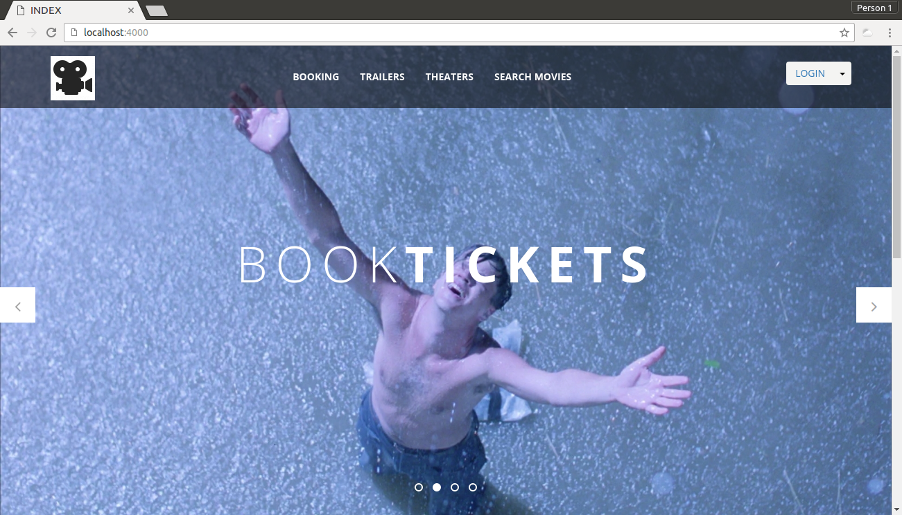
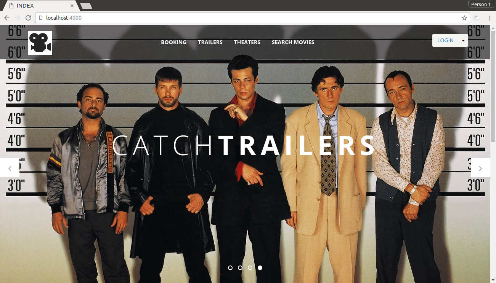
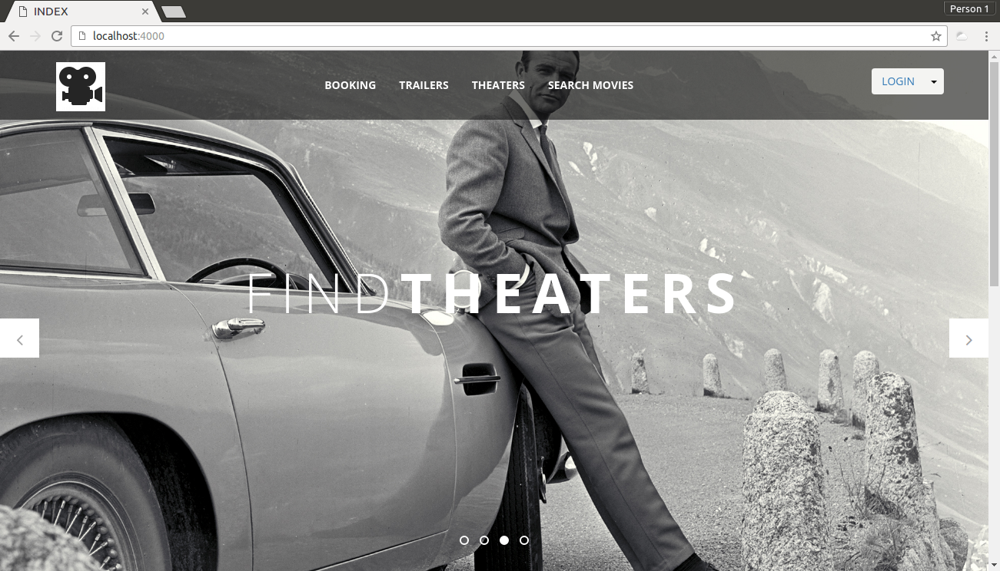
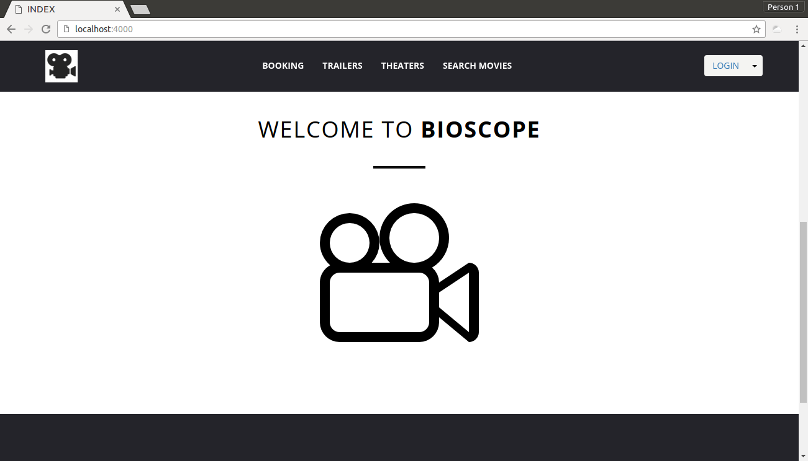
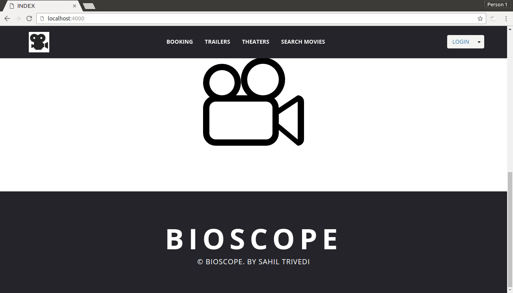
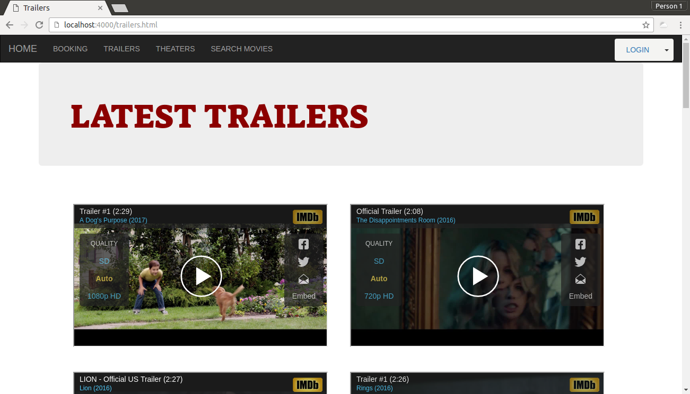
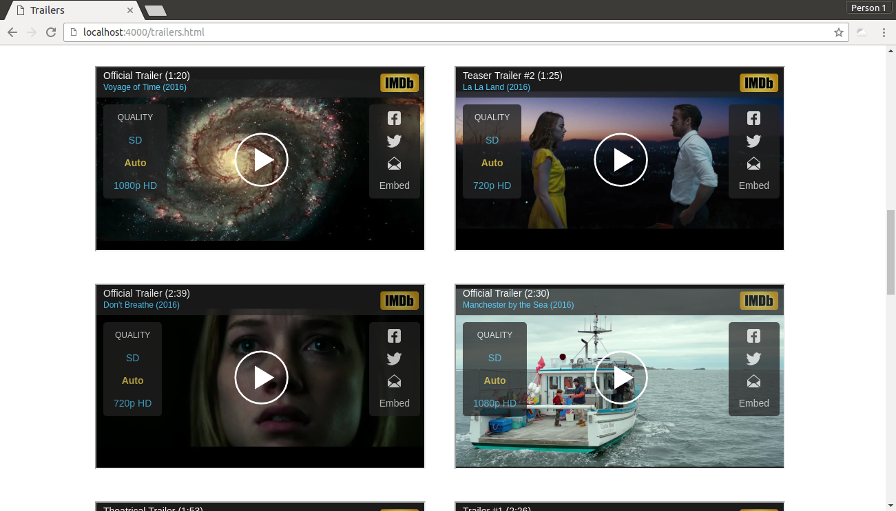
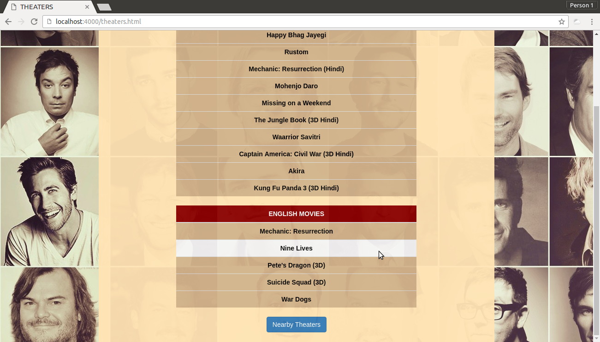
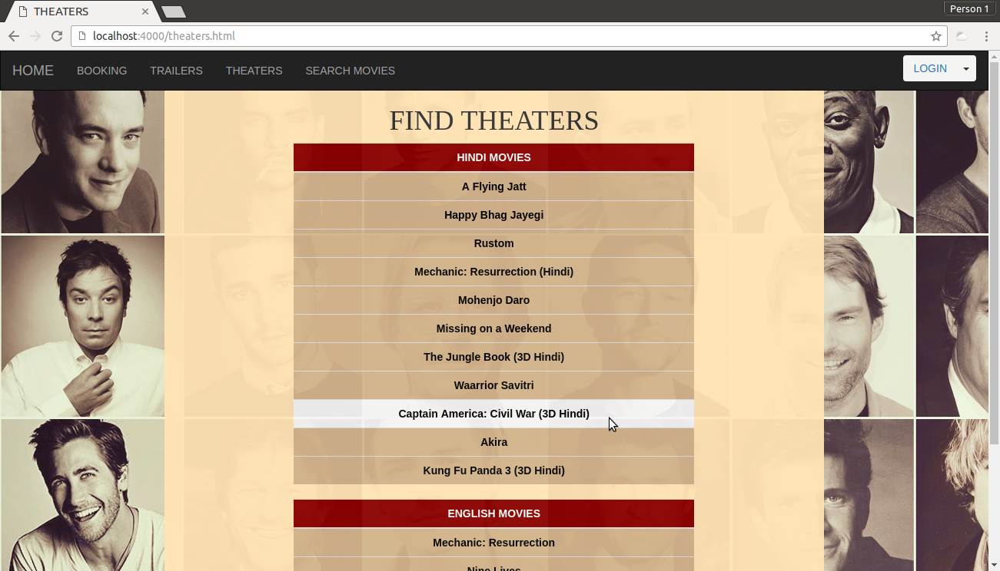
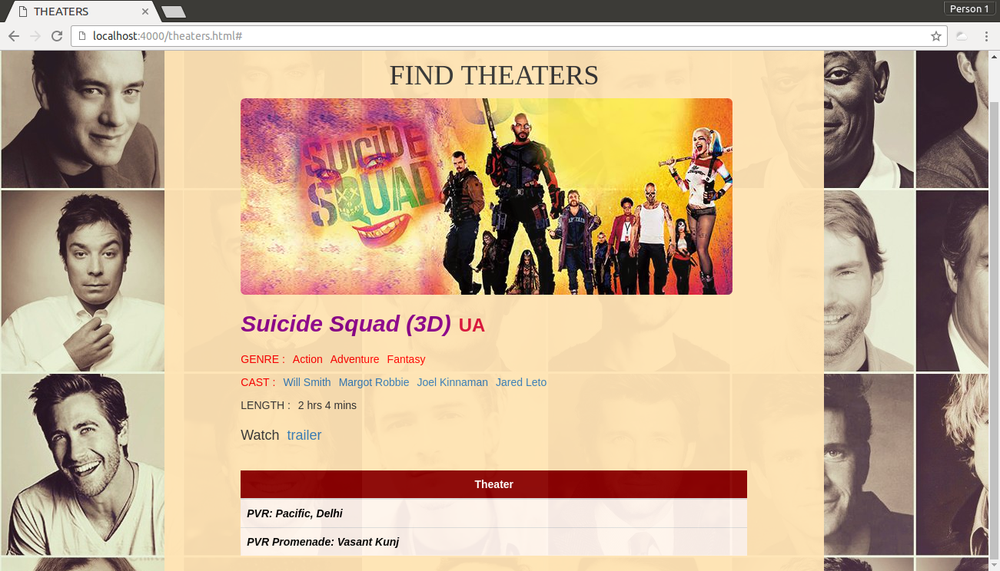
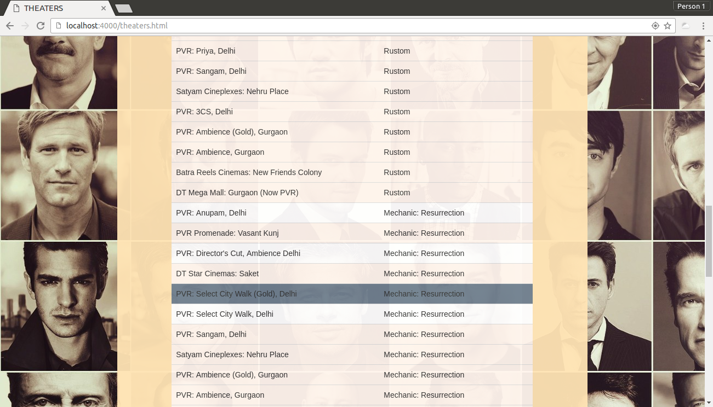
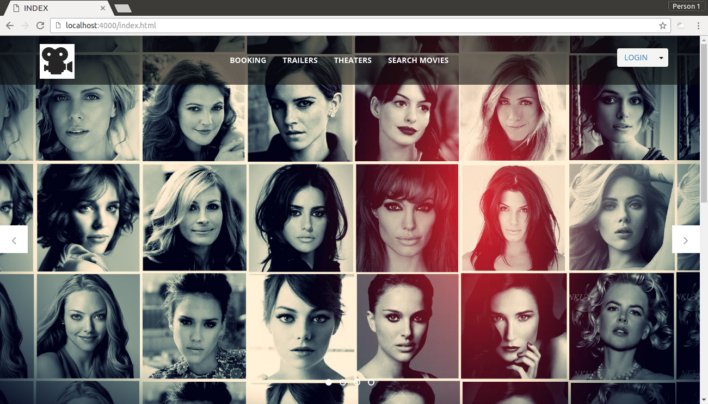
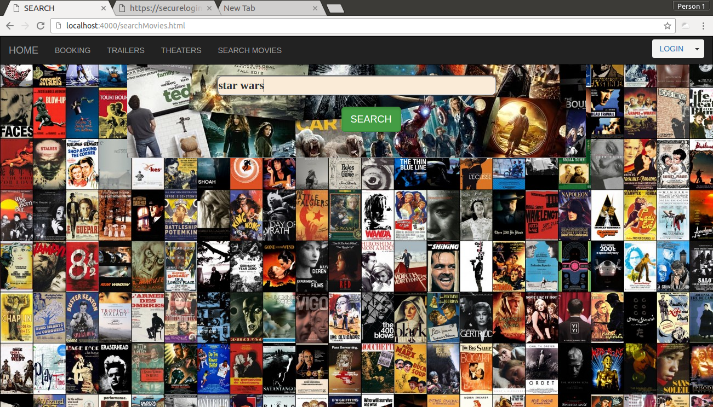
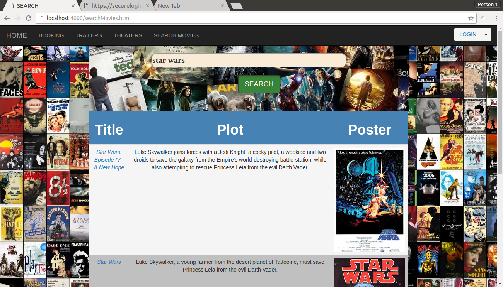
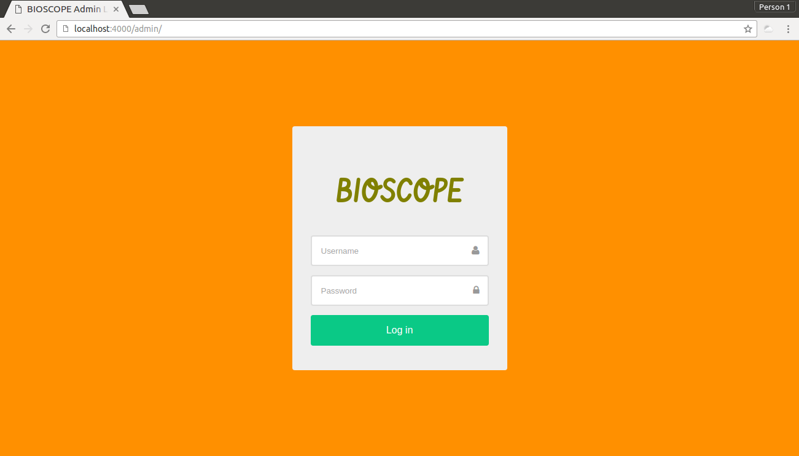
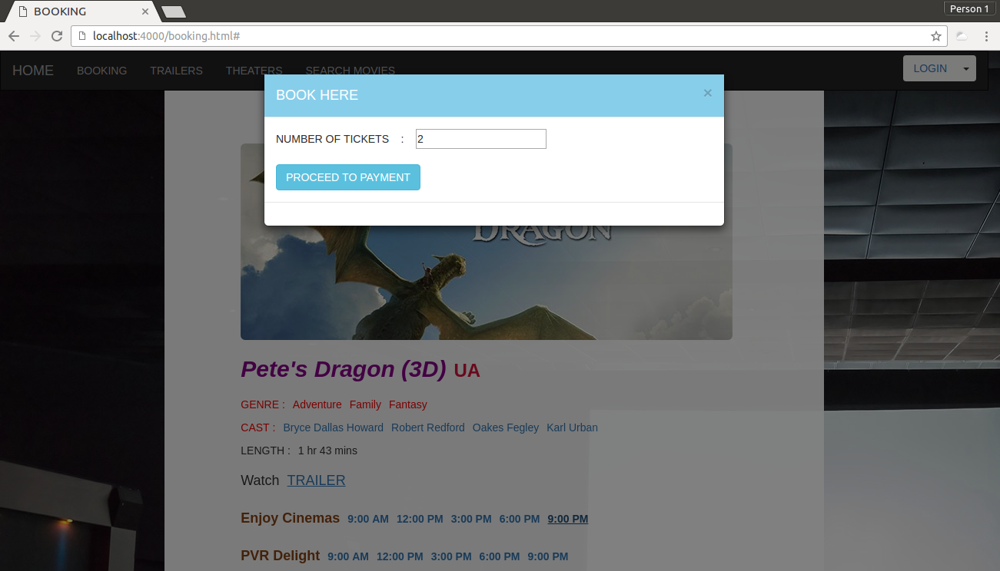


